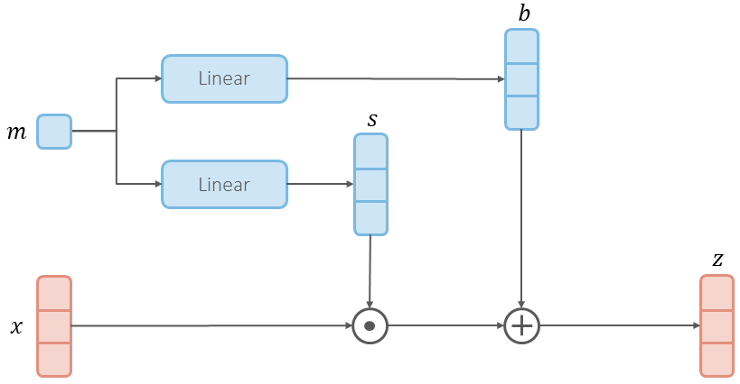
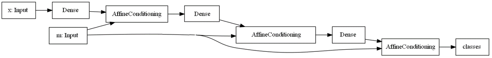
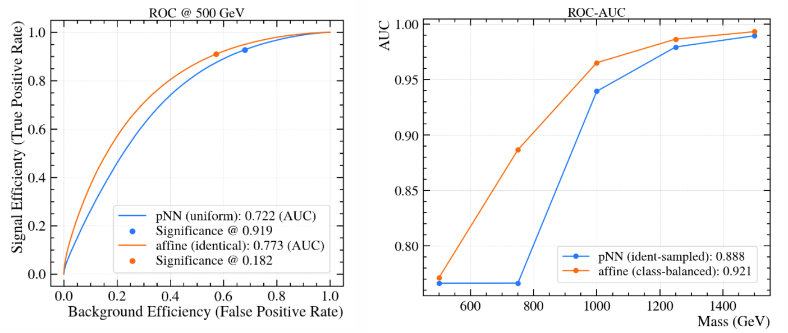
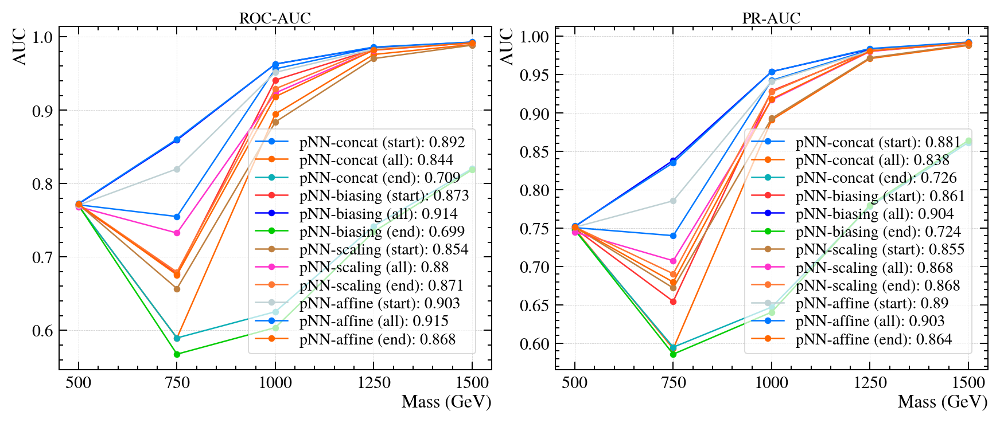

[](https://doi.org/10.5281/zenodo.6453048)

# Affine Parametric Neural Networks


**Parametric Neural Networks** (pNNs) are a kind of neural networks, developed by [Baldi et al.](https://arxiv.org/pdf/1601.07913), which are mainly used for *signal-background classification* in High-Energy Physics (HEP). In our journal [paper](https://iopscience.iop.org/article/10.1088/2632-2153/ac917c), we propose various improvements to the original pNN, one of which is the *affine architecture* based on interleaving multiple **affine-conditioning layers**:



resulting in the following neural architecture (*dropout* is omitted), which we call the **AffinePNN**:



We also demonstrate the effectiveness of our *balanced training* procedure, in which we build balanced mini-batches by leveraging the structure of both the signal and background, as well as discussing the possible choices to distribute the background's mass.

With our proposed improvements, we are able to achieve better *classification* and *interpolation* performance:



**UPDATE 25/02/2023:** added new results about the impact of the *conditioning mechanism*, used when building a pNN to combine 
the features with the physics parameter.



With an interpolation test we found out that both *biasing* and *affine* conditioning mechanisms are robust (i.e. able to 
generalize on the missing mass points) and performant (i.e. achieve high AUC.) Also the best results are achieved when 
the conditioning is performed on *all* layers.

---
## Installation

1. Clone the repository:

   ```bash
   git clone https://github.com/Luca96/affine-parametric-networks.git
   cd affine-parametric-networks
   ```

2. Install all the required libraries (usage of `virtualenv` is highly suggested):

   ```bash
   pip install -r requirements.txt
   ```

3. Download the `HEPMASS` dataset from [here](http://archive.ics.uci.edu/ml/datasets/hepmass): click on "data folder", then download and extract: `all_test.csv.gz` and `all_train.csv.gz`; the latter is only required for the notebook `hep-training.ipynb`. IMPORTANT: save the `.csv` files under the repository folder at `\data\hepmass`.

3. Conversion of HEPMASS: some small changes are made to the original csv files of HEPMASS, you can find the procedure at the beginning of the notebook `HEPMASS.ipynb` or [here](https://zenodo.org/record/6453048).

4. Download and extract our dataset `HEPMASS-IMB`, [here](https://zenodo.org/record/6453048): there are two files in total, `imbalanced_background.csv` and `imbalanced_signal.csv`. As before, save the `.csv` files within `\data\hepmass`.

5. Now you're ready to run the notebooks, or to use the pretrained weights.

### Project  Structure

The repository is organized as follows:

* `\script`: contains the source files used into the notebooks.
* `\weights`: contains all the pretrained weights of our experiments; for `HEPMASS` (under `\hep`) and `HEPMASS-IMB` (under `\hep-imb`)
* `\data`: should contain a folder `\hepmass` in which the dataset (i.e. `.csv` files) are stored.
* `HEPMASS.ipynb`: data exploration of the `HEPMASS` dataset.
* `hep-training.ipynb`: training and evaluation of pNNs for `HEPMASS`.
* `hep-imbalanced.ipynb`: construction of `HEPMASS-IMB`, also with training and evaluation of pNNs on it.
* `mass_representation.ipynb`: contains some t-SNE visualization of the learned internal representation of the trained model.
* `conditioning.ipynb` and `conditioning-interpolation.ipynb`: are about studying the impact of both the type of conditioning mechanism and at which place of the network happens.

---

## Citation

If you use the code and/or the dataset we provide for your own project or research, please cite our paper:

```bibtex
@article{anzalone2022improving,
  title={Improving parametric neural networks for high-energy physics (and beyond)},
  author={Anzalone, Luca and Diotalevi, Tommaso and Bonacorsi, Daniele},
  journal={Machine Learning: Science and Technology},
  volume={3},
  number={3},
  pages={035017},
  year={2022},
  publisher={IOP Publishing}
}
```

Dataset citation:

```bibtex
@dataset{hepmass_imb,
  author={Luca Anzalone and Tommaso Diotalevi and Daniele Bonacorsi},
  title={HEPMASS-IMB},
  month=apr,
  year=2022,
  publisher={Zenodo},
  doi={10.5281/zenodo.6453048},
  url={https://doi.org/10.5281/zenodo.6453048}
}
```

